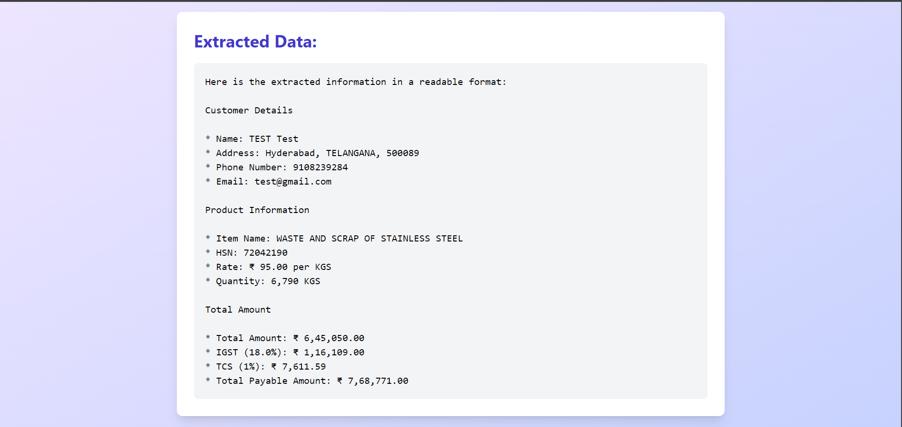

# Invoice Extractor

Invoice Extractor is a web application that allows users to upload PDF invoices and extract key information using AI-powered text analysis. The app uses the Groq API with the LLaMa-70B model for accurate and efficient data extraction.

## Features

- PDF upload and text extraction
- AI-powered invoice data analysis
- Beautiful and responsive user interface
- Real-time data display

## Tech Stack

- **Frontend:**
  - React
  - TypeScript
  - Tailwind CSS (for styling)
  - Framer Motion (for animations)

- **AI/ML:**
  - Groq API
  - LLaMa-70B model

- **PDF Processing:**
  - Custom PDF text extraction module

## Installation

1. Clone the repository: https://github.com/HimanshuSinghBhandari/Invoice-extractor.git
2. Navigate to the project directory:
3. Install dependencies:
4. Set up environment variables:
Create a `.env` file in the root directory and add your Groq API key:

## Usage

1. Open the application in your web browser.
2. Click on the "Choose PDF File" button to upload an invoice.
3. Wait for the AI to process and extract the information.
4. View the extracted data displayed on the screen.

## Acknowledgments

- Groq for providing the AI API
- The LLaMa-70B model for powerful natural language processing